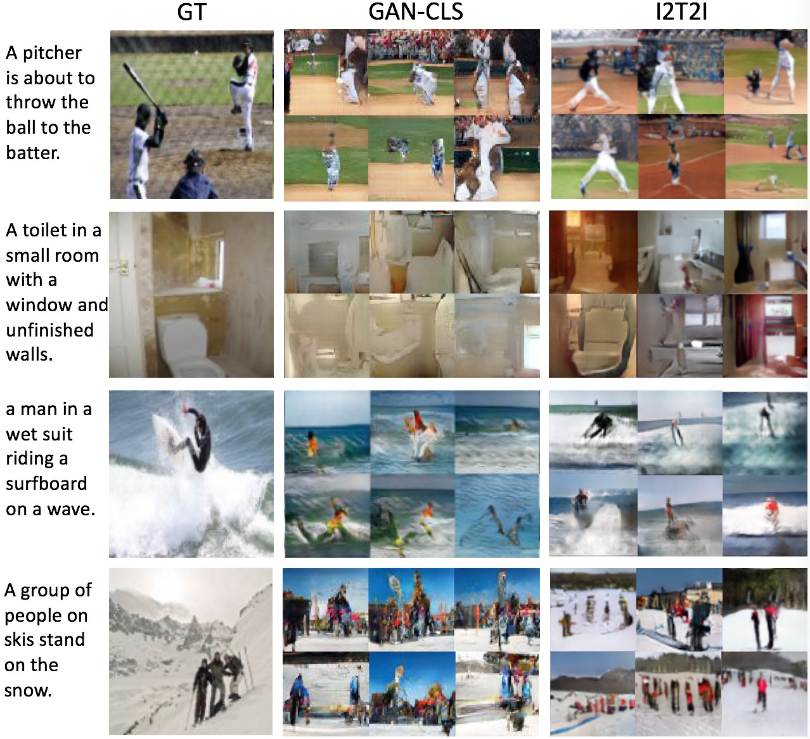
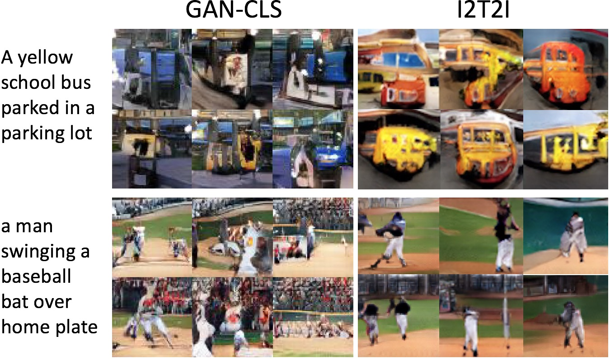
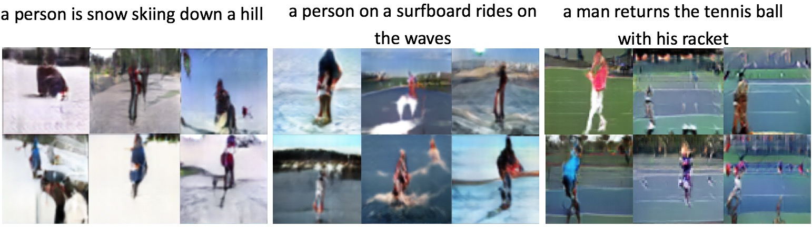

# Image Captioning and Text-to-Image Synthesis with textual data augmentation

This code run well under python2.7 and TensorFlow 0.11, if you use higher version of TensorFlow you may need to update the `tensorlayer` folder from [TensorLayer Lib](https://github.com/zsdonghao/tensorlayer).

## Usage
### 1. Prepare MSCOCO data and Inception model
 * Before you run the scripts, you need to follow Google's [setup guide]((https://github.com/tensorflow/models/tree/master/im2txt)), and setup the model, ckpt and data directories in *.py.
- Creat a ``data`` folder.
- Download and Preprocessing MSCOCO Data [click here](https://github.com/tensorflow/models/tree/master/research/im2txt).
- Download the Inception_V3 CKPT [click here](https://github.com/tensorflow/models/tree/master/slim#Pretrained).

### 2. Train image captioning model
 * Train your image captioning model on MSCOCO by following my [other repo](https://github.com/zsdonghao/Image-Captioning).

### 3. Setup your paths
 * in `train_im2txt2im_coco_64.py` 
 * config your image directory here
`images_train_dir = '/home/.../mscoco/raw-data/train2014/'`
 * config the vocabulary and model of you image captioning module `DIR = "/home/..."`
 * directory containing model checkpoints.
`CHECKPOINT_DIR = DIR + "/model/train"`
 * vocabulary file generated by the preprocessing script.
`VOCAB_FILE = DIR + "/data/mscoco/word_counts.txt"`

### 4. Train text-to-image synthesis with image captioning
* `model_im2txt.py` model for image captioning
* `train_im2txt2im_coco_64.py` script for training I2T2I
* `utils.py` script for utility functions
 
## Results

### 1. Here are some results on MSCOCO

<div align="center">
	
</div>

<div align="center">
	
</div>

### 2. Transfer learning on MHP dataset

<div align="center">
	
</div>

## Citation
* If you find it is useful, please cite:

```
@article{hao2017im2txt2im,
  title={I2T2I: LEARNING TEXT TO IMAGE SYNTHESIS WITH TEXTUAL DATA AUGMENTATION},
  author={Hao Dong, Jingqing Zhang, Douglas McIlwraith, Yike Guo},
  journal={ICIP},
  year={2017}
}
```
